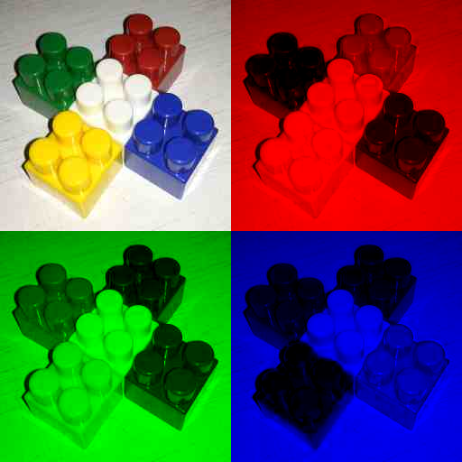

## Работа 2. Исследование каналов и JPEG-сжатия
автор: Полевой Д.В.
дата: 

<!-- url: https://gitlab.com/2021-misis-spring/polevoy_d_v/-/tree/master/prj.labs/lab02 -->

### Задание
1. В качестве тестового использовать изображение data/cross_0256x0256.png
2. Сохранить тестовое изображение в формате JPEG с качеством 25%.
3. Используя cv::merge и cv::split сделать "мозаику" с визуализацией каналов для исходного тестового изображения и JPEG-версии тестового изображения
- левый верхний - трехканальное изображение
- левый нижний - монохромная (черно-зеленая) визуализация канала G
- правый верхний - монохромная (черно-красная) визуализация канала R
- правый нижний - монохромная (черно-синяя) визуализация канала B
4. Результы сохранить для вставки в отчет
5. Сделать мозаику из визуализации гистограммы для исходного тестового изображения и JPEG-версии тестового изображения, сохранить для вставки в отчет.

### Результаты


Рис. 1. Тестовое изображение после сохранения в формате JPEG с качеством 25%


Рис. 2. Визуализация каналов исходного тестового изображения



Рис. 3. Визуализация каналов JPEG-версии тестового изображения


Рис. 3. Визуализация гистограм исходного и JPEG-версии тестового изображения

### Текст программы

```cpp
#include <opencv2/opencv.hpp>
cv::Mat task3(cv::Mat& img){
  std::vector<cv::Mat> channels(3);
  cv::split(img, channels);//bgr
  cv::Mat img_zero = cv::Mat::zeros(cv::Size(img.cols, img.rows), channels[0].type());
  std::vector<cv::Mat> curr_channels(3);
  std::vector<cv::Mat> result_img(3);
  for(int i = 0; i<3; i++){
    curr_channels[0] = (i==0)? channels[0].clone() : img_zero.clone();
    curr_channels[1] = (i==1)? channels[1].clone() : img_zero.clone();
    curr_channels[2] = (i==2)? channels[2].clone() : img_zero.clone();
    cv::merge(curr_channels,result_img[i]);
  }
  // cv::imshow("Image 0", img);
  // cv::imshow("Image blue", result_img[0]);
  // cv::imshow("Image green", result_img[1]);
  // cv::imshow("Image red", result_img[2]);
  cv::Mat res_img(img.rows*2, img.cols*2, img.type());

  img.copyTo(res_img(cv::Rect(0, 0, img.cols, img.rows)));
  result_img[2].copyTo(res_img(cv::Rect(img.cols, 0, img.cols, img.rows)));
  result_img[1].copyTo(res_img(cv::Rect(0, img.rows, img.cols, img.rows)));
  result_img[0].copyTo(res_img(cv::Rect(img.cols, img.rows, img.cols, img.rows)));
  return res_img;
}
cv::Mat task5(cv::Mat& img){
  std::vector<cv::Mat> bgr_planes;
  split( img, bgr_planes );
  int histSize = 256;
  float range[] = { 0, 256 };
  const float* histRange[] = { range };
  bool uniform = true, accumulate = false;
  cv::Mat b_hist, g_hist, r_hist;
  cv::calcHist( &bgr_planes[0], 1, 0, cv::Mat(), b_hist, 1, &histSize, histRange, uniform, accumulate );
  cv::calcHist( &bgr_planes[1], 1, 0, cv::Mat(), g_hist, 1, &histSize, histRange, uniform, accumulate );
  cv::calcHist( &bgr_planes[2], 1, 0, cv::Mat(), r_hist, 1, &histSize, histRange, uniform, accumulate );
  int hist_w = 256, hist_h = 256;
  int bin_w = cvRound( (double) hist_w/histSize );
  cv::Mat histImageBlue( hist_h, hist_w, CV_8UC3, cv::Scalar( 0,0,0) );
  cv::Mat histImageGreen( hist_h, hist_w, CV_8UC3, cv::Scalar( 0,0,0) );
  cv::Mat histImageRed( hist_h, hist_w, CV_8UC3, cv::Scalar( 0,0,0) );
  cv::normalize(b_hist, b_hist, 0, histImageBlue.rows, cv::NORM_MINMAX, -1, cv::Mat() );
  cv::normalize(g_hist, g_hist, 0, histImageGreen.rows, cv::NORM_MINMAX, -1, cv::Mat() );
  cv::normalize(r_hist, r_hist, 0, histImageRed.rows, cv::NORM_MINMAX, -1, cv::Mat() );
  for( int i = 0; i < histSize; i++ )
  {
    cv::line( histImageBlue, cv::Point( bin_w*(i), hist_h ),
          cv::Point( bin_w*(i), hist_h - cvRound(b_hist.at<float>(i)) ),
          cv::Scalar( 255, 0, 0), 1);
    cv::line( histImageGreen, cv::Point( bin_w*(i), hist_h ),
          cv::Point( bin_w*(i), hist_h - cvRound(g_hist.at<float>(i)) ),
          cv::Scalar( 0, 255, 0), 1);
    cv::line( histImageRed, cv::Point( bin_w*(i), hist_h ),
          cv::Point( bin_w*(i), hist_h - cvRound(r_hist.at<float>(i)) ),
          cv::Scalar( 0, 0, 255), 1);
  }
  int border = 2;
  cv::Mat histImage(hist_h*3 + img.rows + border*3 , std::max(hist_w,img.cols), 
        CV_8UC3, cv::Scalar( 255,255,255));
  img.copyTo(histImage(cv::Rect(0, 0, img.cols, img.rows)));
  histImageRed.copyTo(histImage(cv::Rect(0, img.rows + border, hist_w, hist_h)));
  histImageGreen.copyTo(histImage(cv::Rect(0, histImage.rows - hist_h * 2 - border, hist_w, hist_h)));
  histImageBlue.copyTo(histImage(cv::Rect(0, histImage.rows - hist_h, hist_w, hist_h)));
  // cv::imshow("Source image", img );
  // cv::imshow("calcHist Demo", histImage );
  return histImage;
}
int main() {
  //1
  cv::Mat3b img_png = cv::imread("D:\\progects_visual_studio\\image_processing\\data\\cross_0256x0256.png");
  //2
  cv::imwrite("cross_0256x0256_025.jpg",img_png, { cv::IMWRITE_JPEG_QUALITY, 25 });
  //3
  cv::Mat img_png_pars = task3(img_png);
  cv::imwrite("cross_0256x0256_png_channels.png",img_png_pars);
  cv::Mat3b img_jpg = cv::imread("cross_0256x0256_025.jpg");
  cv::Mat img_jpg_pars = task3(img_jpg);
  cv::imwrite("cross_0256x0256_jpg_channels.png",img_jpg_pars);
  //5
  cv::Mat img_png_hist = task5(img_png);
  cv::Mat img_jpg_hist = task5(img_jpg);
  cv::Mat img_hist(std::max(img_png_hist.rows ,img_jpg_hist.rows),
        img_png_hist.cols + img_jpg_hist.cols + 2, CV_8UC3, cv::Scalar( 255,255,255));
  img_png_hist.copyTo(img_hist(cv::Rect(0, 0, img_png_hist.cols, img_png_hist.rows)));
  img_jpg_hist.copyTo(img_hist(cv::Rect(img_hist.cols - img_jpg_hist.cols, 0,
        img_jpg_hist.cols, img_jpg_hist.rows)));
  cv::imwrite("cross_0256x0256_hists.png",img_hist);
  // cv::waitKey(0);
  return 0;
}
```
